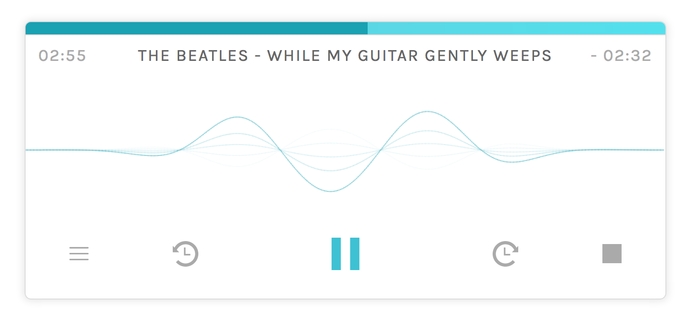

# jQuery SimpleAudioPlayer Plugin
A simple, plug-and-play jQuery Audioplayer Plugin for songs and audiobooks.



## Setup
Clone the repository and install the npm dependencies

```sh
$ git clone https://github.com/dradl/jquery-simpleaudioplayer.git
$ npm install
```

## Usage

### Basic
After including jQuery, include the minified CSS and JS-Files.

```html
<script src="https://ajax.googleapis.com/ajax/libs/jquery/3.3.1/jquery.min.js"></script>
<script src="dist/js/jquery.simpleaudioplayer.js"></script>
<link rel="stylesheet" href="dist/css/simpleaudioplayer.min.css">
```

To instanciate the Plugin, call `.simpleAudioPlayer()` when the DOM is ready to transform any HTML5 ```<audio>``` Element into a SimpleAudioPlayer Instance.


```js
$(document).ready(function() {
	$('audio').simpleAudioPlayer();
});
```


Simply calling `.simpleAudioPlayer()` appends no custom title to the song you're playing. To set a title, use either the `data-title` attribute on the ```<audio>``` Element or bind it to the options-object like that:


```html
<audio id="myAudio" src="song.mp3" data-title="The Beatles - Blackbird"></audio>
```
or

```js
$('audio').simpleAudioPlayer({
	title: "The Beatles - While My Guitar Gently Weeps"
});
```

### Chapters
SimpleAudioPlayer is made for long songs, symphonies or audiobooks. To use a list of chapters, declare them in the options-object by using a title and the position of the chapter (in seconds):


```js
$('#a1').simpleAudioPlayer({
	title: "The Beatles - While My Guitar Gently Weeps",
	chapters: [
		{
			"seconds": 30,
			"title": "<strong>Chapter 1:</strong> The Beginning"
		},
		{
			"seconds": 63,
			"title": "<strong>Chapter 2:</strong> The Middle-Part"
		},
		{
			"seconds": 79,
			"title": "<strong>Chapter 3:</strong> The Peak"
		},
		{
			"seconds": 120,
			"title": "<strong>Chapter 4:</strong> The End"
		}
	]
});
```
Now the chapters-list is available in the player.

### Public methods
There are some public functions available, if you want to bind them to objects outside of SimpleAudioPlayer.

```js
// instanciate the plugin
var myPlayer = simpleAudioPlayer();

// jump by number of seconds (positive or negative)
myPlayer.jumpBy(offset)

// jump to a specific position (second)
myPlayer.jumpTo(seconds)

// fadeOut [duration] seconds long
myPlayer.fadeOut(duration)

// fadeOut [duration] seconds long after [offset] seconds
myPlayer.fadeOutAfterSeconds(duration, offset)

// fadeOut [duration] seconds long after chapter [chapter]
myPlayer.fadeOutAfterChapter(duration, chapter)

// fadeOut [duration] seconds long after [percentage] percent
myPlayer.fadeOutAfterPercent(duration, percentage)
```

## License
Copyright 2018, Dominik Radl.

This work is licensed under Creative Commons Attribution-NonCommercial-ShareAlike 4.0 International (CC BY-NC-SA 4.0) 

[https://creativecommons.org/licenses/by-nc-sa/4.0/](https://creativecommons.org/licenses/by-nc-sa/4.0/)